# Core Poster 打印机使用流程

[English version](Core-Poster-Printer-Workflow.en.md)

以下是我们摸索出来的成功率最高的 Core Poster 打印机使用流程。大家可以根据自己的情况做调整。

## 流程

1. 使用 Weblogin 登录 iLab：

   <https://weblogin.cs.rutgers.edu/guacamole-1.6.0/#/>

   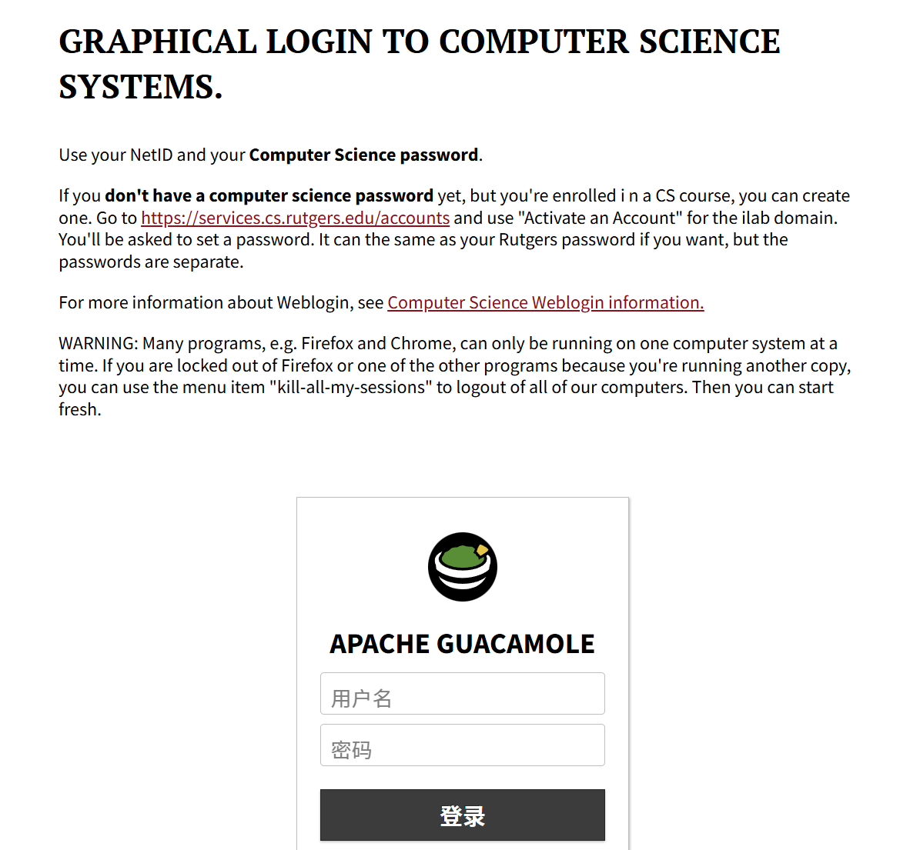

   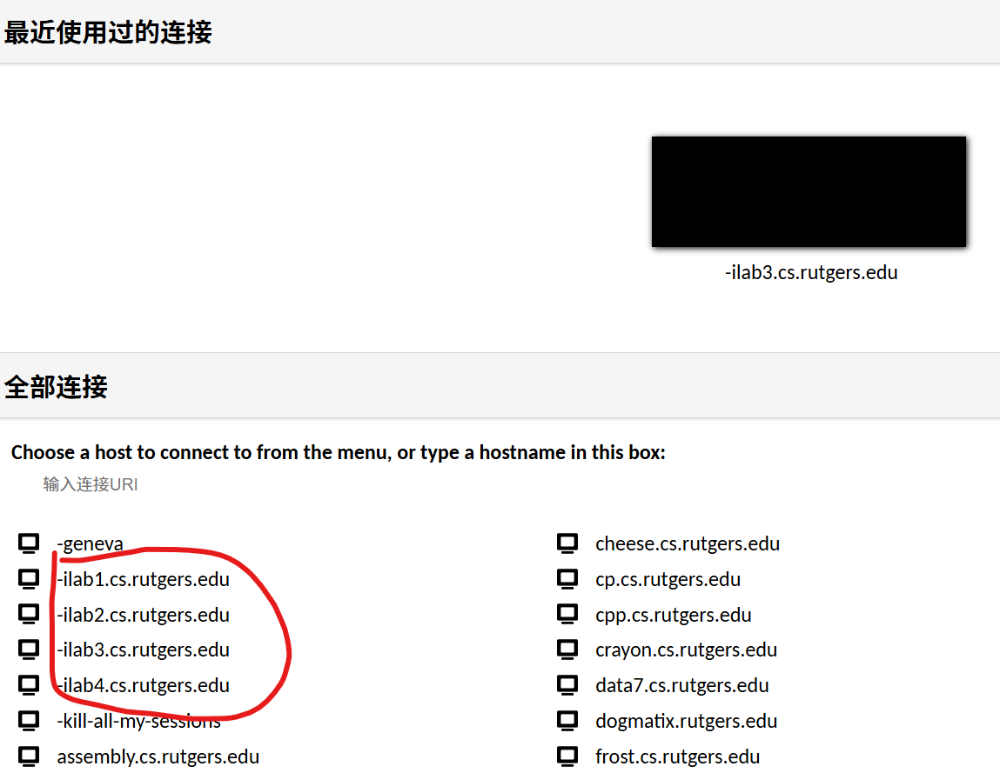

2. 将需要打印的 poster（PDF 格式）下载到 iLab 服务器上。可以使用邮箱、网盘等方式传输文件。

3. 在 iLab 虚拟机上，用 **Atril Document Viewer** 打开你的 poster。我们只成功了这个PDF Viewer。

   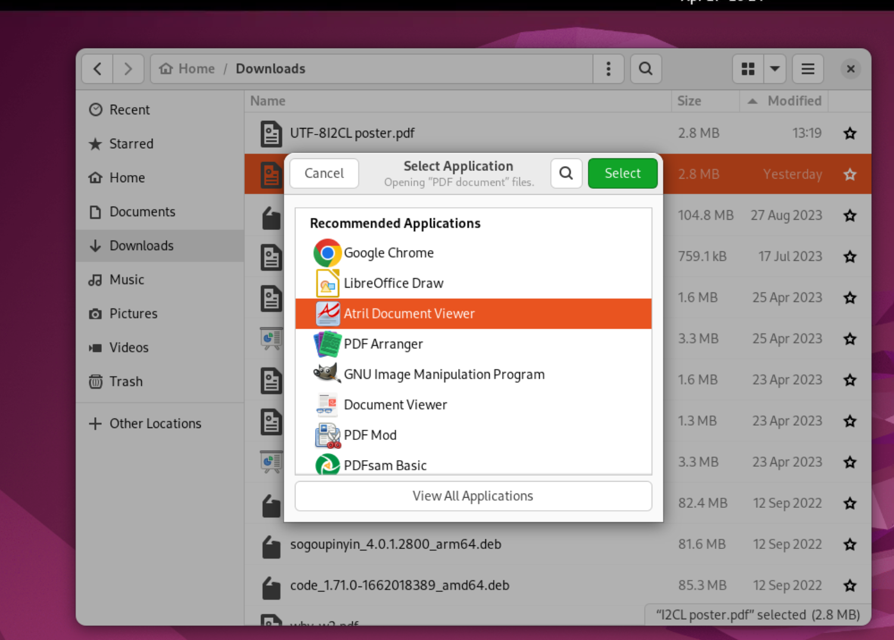

4. 在 Atril Document Viewer 中按 `Ctrl + P`，并设置以下参数。

   `General` -> `Printer` -> `artisan`

   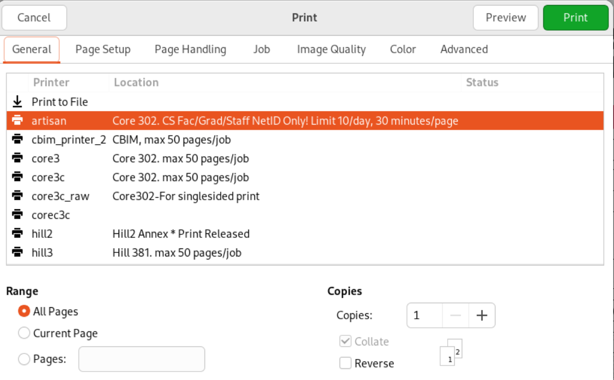

5. 切换到`Page Setup`选项卡:

   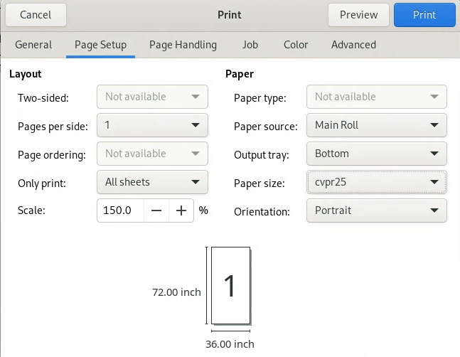

   - `Scale`: 根据海报文件尺寸计算缩放比例。

      > 请**一定一定一定**把海报的短边缩放至 `36 in`，这个打印机没法打印更宽的海报了。

      例如，如果海报PDF文件的尺寸是 `48 in x 24 in`，而你想获得一张真实尺寸为 `72 in x 36 in` 的海报，请使用 `150%` 作为缩放比例。

      如果你不知道PDF文件的原尺寸，请在Atril菜单栏里点击`File` -> `Properties`。
   
   - `Paper Size`: 选择 `Custom Size`，并设置为**缩放完成后**海报的实际大小。以上面的例子为例，缩放后为 `72 in x 36 in`。
   
      > 请在 `Width` 中填 `36`，在 `Height` 中填 `72`。尽管你的海报也许是横向的，但打印机的最大宽度是`36`，所以你的海报是竖着打出来的。如果`Width`大于`36`，打印机那边会有问题。

      对于`Margins`设置，请点击`Margins from Printer`，直接从打印机设置里获取边距。

      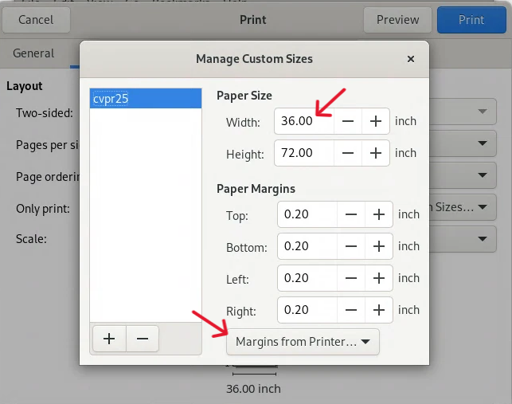

   - `Orientation`: 页面大小设置完毕之后，纸张朝向会自动变成横向或者纵向。

6. 切换到`Page Handling`选项卡，按下图设置。

   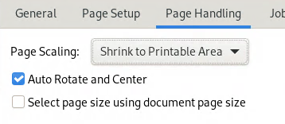

7. 点击 `Preview` 按钮（在 `Print` 按钮右边），确保打印的海报朝向和缩放正确，并且没有留下大量白边。

   <table>
     <tr>
       <th>正确 ✔</th>
       <th>错误 ✘</th>
     </tr>
     <tr>
       <td valign="top">
         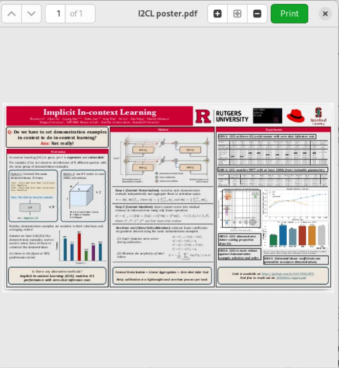
       </td>
       <td valign="top">
         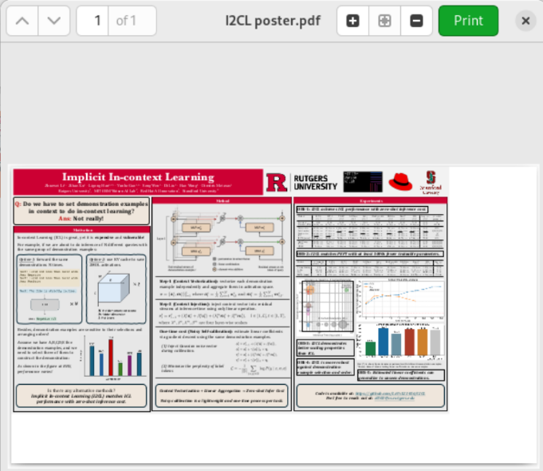
       </td>
     </tr>
   </table>

8. 点击 `Print`，然后到 Core 三楼打印室等待打印。

   如果弹出尺寸警告，请在打印机上按 `Print Anyway`（左起第二个选项）。如果因其他原因导致打印中止或报错，可以直接重启打印机。如果还有问题，请直接拨打墙上的电话。

   Core 三楼打印机：

   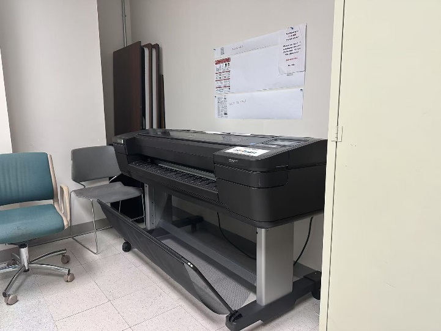

## 成品展示

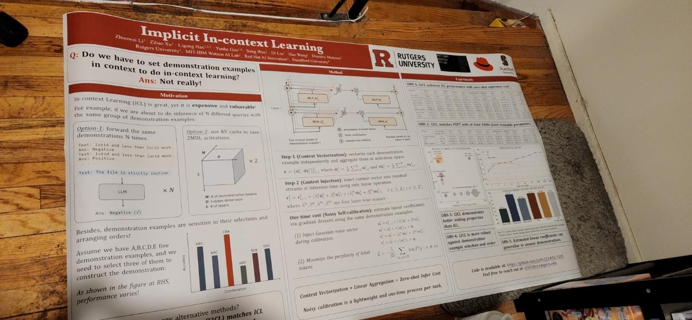

## 备注

- 以下几个打印机 warning 不用在意。如果确实没有油墨了，请通过墙上的电话联系工作人员。
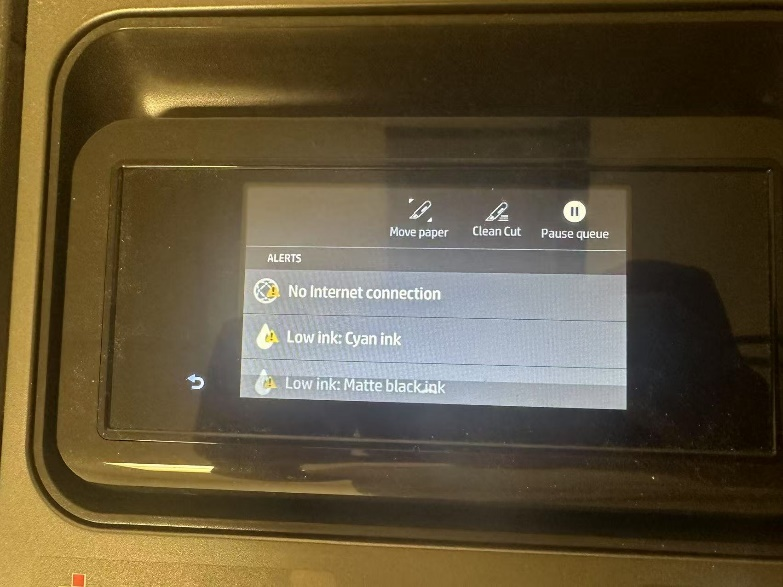

- 如果电话也打不通的话，直接去CoRE 235 的LCSR Operator找人。如果CoRE 235还没人的话，问一下邻近LCSR办公室的职员。他们也很懂的。

- 提交打印机任务后通常会有短暂的pending。通过学校内网，在这个网页中 [https://printserver.cs.rutgers.edu/jobs/](https://printserver.cs.rutgers.edu/jobs/) 可查看job提交情况。如果超过15分钟没反应，可在ilab terminal中检查打印机状态：
   ```bash
   lpstat -p artisan
   ```
   如果状态是这个，那么需要联系学校职员：
   ```bash
   printer artisan disabled since <time> -
	cfFilterChain: pdftopdf (PID 2520749) exited with no errors.
   ```
   这个状态是可以工作的：
   ```bash
   printer artisan is idle.  enabled since <time>
   ``` 