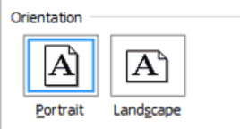
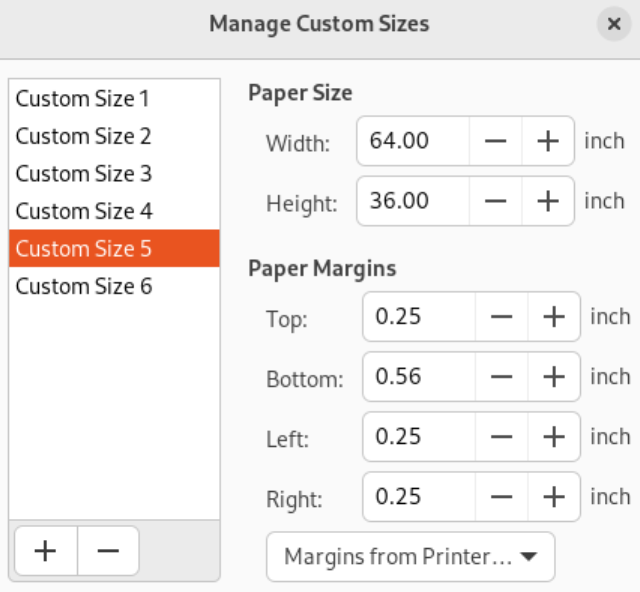
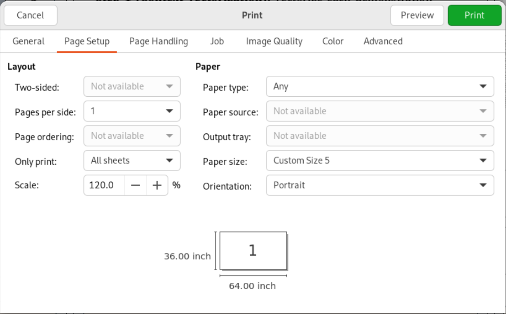

# Core Poster 打印机使用流程

[English version](Core-Poster-Printer-Workflow.en.md)

以下是我们摸索出来的成功率最高的 Core Poster 打印机使用流程。大家可以根据自己的情况做调整。

## 流程

1. 使用 Weblogin 登录 iLab：

   <https://weblogin.cs.rutgers.edu/guacamole-1.5.5/#/>

   

   

2. 将需要打印的 poster（PDF 格式）下载到 iLab 服务器上。可以使用邮箱、网盘等方式传输文件。

3. 在 iLab 虚拟机上，用 **Atril Document Viewer** 打开你的 poster。我们只成功了这个PDF Viewer。

   

4. 根据海报文件尺寸**计算**缩放比例。**请一定把海报的短边缩放至 `36 in`**。

   例如，如果海报文件原尺寸是 `53.3 in x 30 in`，请使用 `120%` 作为缩放比例，最终会得到一张 `64 in x 36 in` 的海报。

5. 在 Atril Document Viewer 中按 `Ctrl + P`，并设置以下参数。

   `General` -> `Printer` -> `artisan`

   

   `Page Setup`:

   - `Scale`: 填入**第 4 步计算出的比例**。以上面的 `53.3 in x 30 in` 为例，`Scale` 为 `120%`。
   - `Orientation`: 选择 `Landscape`。这里假定你的海报文字是横向排布的。

   

   - `Paper Size`: 选择 `Custom Size`，并设置为**缩放完成后**海报的实际大小。以上面的例子为例，缩放后为 `64 in x 36 in`，请在 `Width` 中填 `64`，在 `Height` 中填 `36`。`Margin` 不需要改变。

    

   

   `Page Setup` 页面示例：

   

6. 点击 `Preview` 按钮（在 `Print` 按钮右边），确保打印的海报朝向和缩放正确，并且没有留下大量白边。

   <table>
     <tr>
       <th>正确 ✔</th>
       <th>错误 ✘</th>
     </tr>
     <tr>
       <td valign="top">
         
       </td>
       <td valign="top">
         
       </td>
     </tr>
   </table>

7. 点击 `Print`，然后到 Core 三楼打印室等待打印。

   如果弹出尺寸警告，请在打印机上按 `Print Anyway`（左起第二个选项）。如果因其他原因导致打印中止或报错，可以直接重启打印机。如果还有问题，请直接拨打墙上的电话。

   Core 三楼打印机：

   

## 成品展示

## 备注

以下几个打印机 warning 不用在意。如果确实没有油墨了，请通过墙上的电话联系工作人员。

